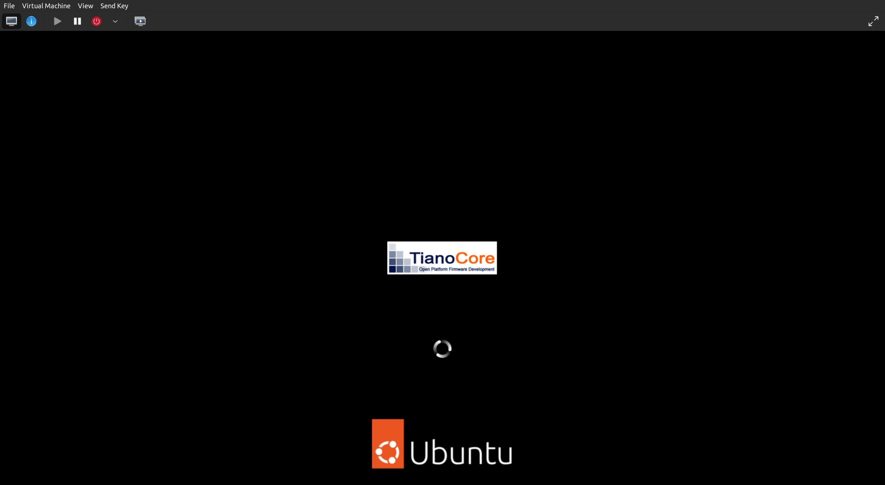
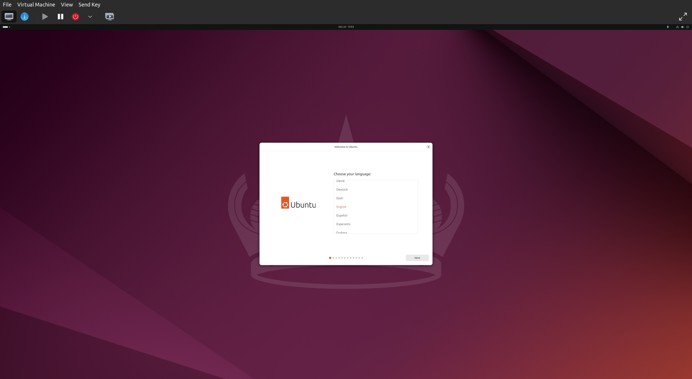
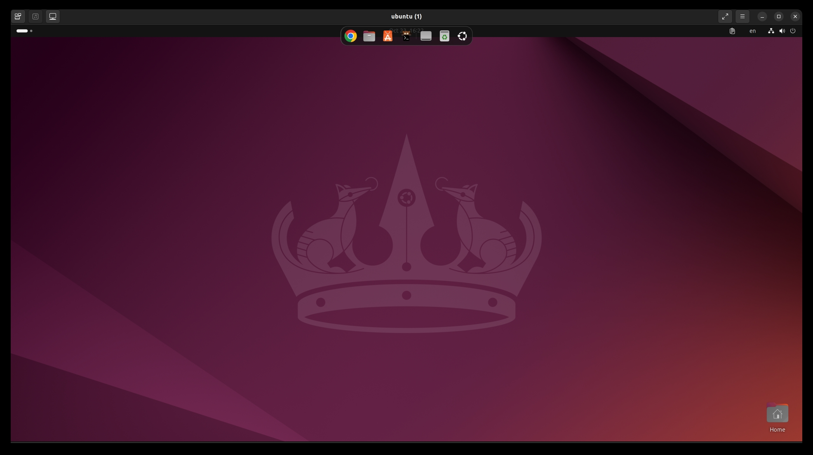
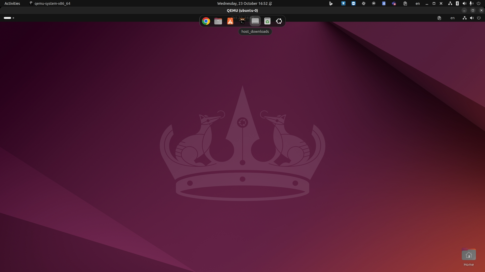

# qemu-opengl
Playground for QEMU with OpenGL, Audio, Shared Folder, Copy &amp; Paste, etc.

## Steps
1. Install the prerequisite softwares: **virt-manager**, **qemu** version 7.0, etc.
 ```
 $ ./install_software_dependecies.sh
 ```
2. Create the supported VM, currently support *Ubuntu 24.04* and *KDE Neon user version 20240917-0204*
 ```
 # create Ubuntu 24.04 VM
 $ ./create_ubuntu-24-04_vm.sh
 # or create KDE Neon VM
 $ ./create_kde-neon-new_vm.sh
 ```
3. Open the **virt-manager** app to continue the OS installation
 
4. There're 2 ways to run the VMs:
  + Use **SPICE protocol**: execute the `ubuntu-24-04-sparse_remote-viewer.sh` script to run the qemu background process then run `remote-viewer.sh` script to control the VM.
  This mode supports both file sharing and clipboard sharing between host and guest VMs. However, the latency is a little bit high but still acceptable.
  

  + Use the `ubuntu-24-04-sparse-gl.sh` script to run the VM with SDL OpenGL mode. This mode gives the best latency performance.
  However, it doesn't support clipboard sharing out-of-the-box, only file sharing. Still, the clipboard sharing could also be achieved using the `uniclip` tool.
  

 ## Tips:
 ### Use the `get_qemu_options_from_virt-manager***.sh` script:
 to get and analyze the QEMU options from the specific libvirt VM.

 ### Issues:
   + **TPM version '2.0' is not supported**
      ```
        File "/usr/lib/python3/dist-packages/libvirt.py", line 4484, in defineXML
        raise libvirtError('virDomainDefineXML() failed')
        libvirt.libvirtError: unsupported configuration: TPM version '2.0' is not supported
      ```
      **Solution**:
       1. Install swtpm to newest version at: https://launchpad.net/~stefanberger/+archive/ubuntu/swtpm-jammy
             ```
             sudo add-apt-repository ppa:stefanberger/swtpm-jammy
             sudo apt install -y swtpm swtpm-tools libtpms
             ```
       2. Fix the permissions for `libvirtd` by editing `/etc/libvirt/qemu.conf`:
             ```
             # User for the swtpm TPM Emulator
             #
             # Default is 'tss'; this is the same user that tcsd (TrouSerS) installs
             # and uses; alternative is 'root'
             #
             #swtpm_user = "tss"
             #swtpm_group = "tss"
             swtpm_user="swtpm"
             swtpm_group="swtpm"
             ```
       3. Restart `libvirtd` service: `sudo systemctl restart libvirtd`
